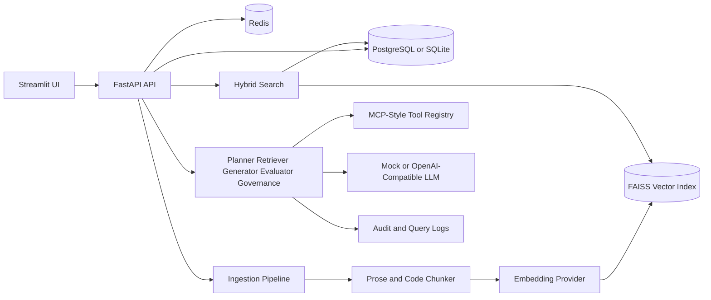

# Enterprise Knowledge Agent Platform using MCP, RAG, and Hybrid Search

Production-style portfolio project for an enterprise AI knowledge platform. It ingests internal documents and code, chunks and embeds content, indexes vectors in FAISS, ranks results with hybrid search, and answers questions through a governed RAG agent pipeline with MCP-style tools, audit logging, metrics, and citations.

## Why This Matters

Enterprise AI systems need more than a chat box. They need governed retrieval, traceable answers, access controls, operational metrics, local testability, and clean tool contracts that can grow into agentic workflows. This project demonstrates those platform engineering patterns with a backend-first architecture.

## Architecture



## Features

- Upload PDF, Markdown, TXT, JSON, YAML, Python, Java, JavaScript, TypeScript, and generic code files.
- Duplicate detection with SHA-256 checksums.
- Metadata-preserving prose and code chunking with stable citation IDs like `[doc:12-chunk:3-abcd1234]`.
- Mock and OpenAI-compatible embedding providers.
- FAISS local vector search with an abstraction that can later support Qdrant or Weaviate.
- Hybrid search combining semantic similarity, keyword relevance, metadata filters, and recency boost.
- RAG `/ask` pipeline with query planning, retrieval, answer generation, evaluation, governance checks, citations, confidence, risk, latency, and trace IDs.
- MCP-style tools: `search_documents`, `read_file`, `summarize_document`, `create_ticket`, `generate_pr_summary`, and `search_codebase`.
- Audit logs, prompt version records, query logs, health, and basic metrics.
- Streamlit UI for ingestion, Q&A, search, tools, tickets, and observability.
- Docker Compose for backend, frontend, Postgres, and Redis.
- Pytest suite runs with mock providers and no API keys.

## Tech Stack

Backend: Python 3.11, FastAPI, Pydantic, SQLAlchemy, PostgreSQL, Redis, FAISS, Pytest.

Frontend: Streamlit, API-first backend for future React clients.

DevOps: Docker, docker-compose, GitHub Actions, Makefile, `.env.example`.

LLM: Mock provider by default, optional OpenAI-compatible provider through environment variables.

## Folder Structure

```text
backend/app/core       settings, logging, security, telemetry
backend/app/db         SQLAlchemy models and sessions
backend/app/ingestion  loaders, chunker, embeddings, ingestion pipeline
backend/app/search     vector store, keyword search, hybrid ranking
backend/app/llm        provider abstraction, mock, OpenAI-compatible client
backend/app/tools      MCP-style tool base, registry, concrete tools
backend/app/agents     planner, retriever, generator, evaluator, governance
backend/app/services   document, ask, ticket, audit, metrics services
backend/app/api        FastAPI route modules
frontend/pages         Streamlit application pages
docs                   architecture and interview notes
```

## API Endpoints

- `GET /health`
- `GET /metrics/basic`
- `POST /documents/upload`
- `GET /documents`
- `GET /documents/{document_id}`
- `GET /search?q=governance&top_k=5&search_mode=hybrid`
- `POST /ask`
- `GET /tools`
- `POST /tools/{tool_name}/execute`
- `POST /tickets`
- `GET /tickets`
- `GET /tickets/{ticket_id}`
- `PATCH /tickets/{ticket_id}`
- `GET /audit-logs`

## MCP-Style Tools

Each tool has a name, description, input schema, output schema, and `execute` method. `GET /tools` exposes the registry, and `POST /tools/{tool_name}/execute` runs a tool with JSON arguments. This mirrors MCP concepts while keeping the project self-contained for local development.

## RAG Pipeline

1. `QueryPlannerAgent` classifies intent.
2. `RetrieverAgent` calls hybrid search or code search.
3. `AnswerGeneratorAgent` sends retrieved context to the selected LLM provider.
4. `EvaluatorAgent` scores citation coverage, relevance, completeness, and confidence.
5. `GovernanceAgent` enforces citations and no-context safeguards.

If no relevant chunks are found, the answer states that there is not enough context.

## Governance and Observability

Access levels are `public`, `internal`, and `restricted`. Query-time filtering prevents lower-clearance users from seeing restricted chunks. Audit logs are written for uploads, search, ask, tool execution, ticket creation, and governance failures. `/metrics/basic` reports document counts, chunk counts, query counts, failed queries, latency, tickets, and governance failures.

Structured JSON logs include trace ID, query, mode, retrieved chunk count, retrieval scores, latency, provider, token usage when available, hallucination risk, and governance status.

## Run Locally

```bash
cd enterprise-knowledge-agent
cp .env.example .env
make install
make api
```

In another terminal:

```bash
make ui
```

Backend: `http://localhost:8000/docs`

Frontend: `http://localhost:8501`

## Run With Docker

```bash
cd enterprise-knowledge-agent
docker compose up --build
```

## Run Tests

```bash
cd enterprise-knowledge-agent
make test
```

No real LLM or embedding keys are required because `LLM_PROVIDER=mock` and `EMBEDDING_PROVIDER=mock` are the defaults.

## Example Requests

```bash
curl -F "file=@docs/sample_data/platform_governance.md" -F "access_level=internal" http://localhost:8000/documents/upload
curl "http://localhost:8000/search?q=citation%20governance&search_mode=hybrid&top_k=3"
curl -X POST http://localhost:8000/ask -H "Content-Type: application/json" -d '{"user_query":"How are citations governed?","top_k":3,"search_mode":"hybrid","access_level":"internal"}'
```

